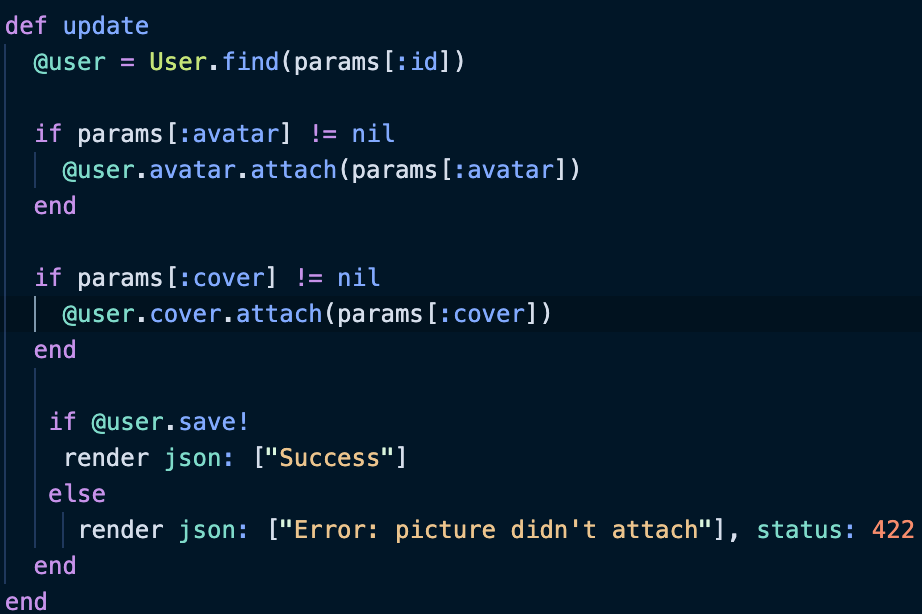

# Fumblr

A full stack clone of the popular social media site [Tumblr](https://www.tumblr.com/explore/trending?source=homepage_explore).

[Fumblr Live Link](https://fumblr11.herokuapp.com/#/explore)

## Functionality & MVPs

Users will be able to:

    - Create a new account or login with a pre-existing Demo user
    - Create, edit, and delete posts
    - Like and comment on any post they see
    - Follow and unfollow other users

## Technologies, Libraries, APIs

    - React
    - Redux
    - Ruby on Rails
    - AWS 
    - Javascript
    - HTML
    - CSS

## Code Snippets

Below is a code snippet taken from the users controller. It executes when a user attempts to update either their profile or cover picture, and checks to see if one or both are present. If so, the image(s) attach to the user and the process is reflected across the application.

